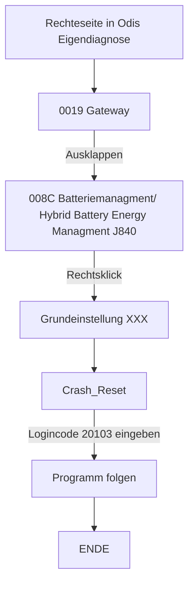

# Audi E-Tron GT HV Reset
In diesem Repository habe ich alle Schritte zusammengefasst, die nötig waren, um meinen Audi E-Tron GT nach einem Unfall wieder vollständig freizuschalten und in Betrieb zu nehmen. Von der ersten Fehlerdiagnose über die Arbeit mit ODIS, der Rückstellung der Airbag- und Hochvoltsysteme bis hin zur finalen Freigabe durch das Fahrzeug.

## Disclamer
- Dies ist nur ein Bericht meiner erfahrung er kann fehler enthalten und jeder der keine Sachkundige ausbild oder schulung besitzt sollte keine Reperaturen am HV System oder E-Fahrzeugen im Allgemeinen druchführen. Handeln auf eigene Gefahr.<!--Hier besserer Rechtsschutz-->
- Alle bilder wurden mittels KI überarbeitet damit sie besser lesbar sind. Es fand keine Änderung des groben Inhalts statt.

## Audi E-Tron GT / Porsche Taycan
Beide Stehen auf der J1 Plattform, die von Porsche entwickelt wurde.
Falls ihr Bauteile für euer Projekt benötigt es sind viele Teile unter den modellen austauschbar. (Hier kommt noch mehr)

## Bestandausnahme
Kurz zu meinem Fahrzeug, das Fahrzeug ist ein audi erton gt von 2022. Es hatte einen rechtsseitigen frontal crash (was genau passiert ist weiß ich noch nicht).
Ausgelöst wurden alle ffrontairbags und die Seitlichen Kopfairbags.
Laut den technischen daten von audi ist dieser Crash nicht durhc einen Klemme 15 reset (Batterie abklemmen und wieder anklemmen) behebbar.

Beschädigt war somit:
- die ganze rechte Front.
- Der Laderegler 
- Die Hochvoltheizung
- Der Scheinwerfer 
- usw.

# HV Reset
Kurz zum aufbau des Schaltkasten der Hochvoltbatterie SX6 inklusive Zünder für Hochvoltbatterieunterbrechung N563, in diesem Befinden sich **KEINE Pyrotrechnischen Sicherungen** in manchen Foren im Internet wird dies behauptet, dies ist aber nicht richtig.
  - (Anders zum Audi E-Tron 55, Q8, Q4 diese besitzen eine Pyrotechnische Sicherungen die bei einem Crash ausgelöst werden kann)

Im SX6 befinden sich aber 2 Schütze (große Relais) und 2 Sicherungen (die sehr stark an NH Sicheurngen erinnern). Eine für die Positive Seite und eine für die negative Seite.

 <!--Hier bild aus Video vom Inneren der SX6-->

Es kann sein das bei einem Crash mit einem Körperschluss des HV Systems diese Sicherungen auslösen. 
Falls dies der Fall sein sollte, sollten beide Schütze und beide Sicherungen getauscht werden egal ob diese Defekt sind oder nicht (wenn sie es jetzt noch nicht sind werden sie es bald sein).
## 1. Benötigte Werkzeuge
- Messgerät
- 1000V Handschuhe
- ODIS Service V.25.0.1 und neuer (bei älteren Versionen kann es sein das manche fehlercodes nicht richtig interpretiert werden können, dann steht dort soetwas wie P00001 Entickelungscode 1 oder so)
  - **KEINE Internet verbindung**
  - VX Diag Paththrou Device J.... (XXX)
- Werkzeugkasten

- **Interessantes**
    - Woher Dokumentation
  
## 2. Airbag-Steuergerät fehler beheben

Das Steuergerät 0015 Airbag darf keine Statischen fehler enthalten. Der Crash-Reset in diesem Steuergerät kann nur mit einer Odis Online Version erfolgen oder der Service wird bei einschlägigen Anbietern im Internet erworben (~120€).

Alle anderen fehler die zusammenhängen mit den nicht mehr funktionsfähigen Airbags und Sicherheitsgurten können mit einer offline Version von Odis zurückgesetzt werden. 

Die Sicherheitsgurte müssen über die Grundeinstellung im Geführten funktrionen menue neu angelernt werden. Danach sind diese Fehler Passiv und können gelöscht werden.
 - 0015 Airbag -> Geführte Funktionen -> Grundeinstellung Sicherhheitsgurt Li, Re usw.
   

Alle anderen Airbag Fehler werden von Aktiv/Statisch zu Passiv wenn die Airbags durch neue ersetzt wurden. Und die Sensoren/ Sensorleitungen repariert wurden.
Danach können alle gelöscht werden.

## 3. Klassifizierung des HV Systems

Nachdem das Hochvoltsystem von einem Techniker Geprüft wurde der die nötige Freigabe dazu besitzt kann das HV System Klassifiziert werden.

- Sonderfunktionen -> Klassifizierung des Hochvoltsystems

Sollte der Odis tester hier nicht die Zellspannungen der einzelnen Module lesen können ist die Version von Odis zu alt. Es findet dann nicht die benötigten daten in seiner Datenbank.

Nachdem Odis auf die neuste Version geupdatet wurde (Version >=25.0.1) sollte die Klassifizierung erfolgreich beendet werden.

## 4. Initialisierung HV System
<!--War das wirklich der 3. Punkt?-->
Danach kann versucht werden das HV-System zu Initialisieren, wie es auch gemacht wird wenn das Fahrzeug gewartet wurde oder komponenten ausgetauscht wurden.
Wenn an den Fehler bekommt das das 008C Batteriemanagment/ Hybrid Battery Energy Managment J840 das hochfahren blockiert und man die folgenden Spannungswerte ausgelesen werden muss der Fehlerspeicher des Moduls J840 nocheinmal neu ausgelesen werden.

Im 008C sollten nun folgende Fehler hinterlegt sein:

## 5. Grundeinstellung HV System
<!--Fehlercode Thematisieren (HV contaktor defekt oder so inklusive bild)-->
Es kann auch vorkommen das unter den fehlern im 008C in Punkt 4 "Steuergerät defekt" oder ähnliches steht. Dies seint daran zu liegen, dass die wartezeit für das Vorladen der Hochvoltkontakte laut dem Steurgerät zu lange genauert hat und es somit einen defekt interpretiert

> [!TIP]
>
> - Die Vorladekontakte laden mit einem geringeren Strom über einen Widerstand die Kontakte vor, damit der einschaltlichtbogen bzw der Einschaltstrom nicht zu hoch ist. Dieser könnte durch den hohen Strom sonst Bauteile beschädigen.
>   

Die andern Fehler wie "P0ADD00 Ansteuerung des Minuskontakt der Hybrid-/Hochvoltbatterie elektrischer Fehler (00101111 aktiv/statisch)" sind Statisch da die Crash abschltung des HV-Systems in der Batterie (im SX6) noch aktiv ist.

Dies kan behoben werden indem mittels Eigendiagnose der Crash zurückgesetzt wird.
<!-- Bidl vom eigendiagnosebutton und tab -->

 (XXX)(<- der name ist glaube ich falsch wird nochmal geprüft)
 
 danach Zündwechsel druchführen , ein lautes Schützschalten sollte zu höhren sein beim wiedereinschalten. Fahrzeug kann in D oder R geschaltet werden, Fahrzeug fährt

 <!--Bild Odis Conector fehler-->

<!-- Technische Sachen zum vorladewiderstand und den schützen bezug zu oben -->

Zu guter letzt muss via eigendiagnose der Crash wert im HV Sytem zurückgesetzt werden. Dazu eigendiagnose HV Hybrid managment 008C Batteriemanagment/ Hybrid Battery Energy Managment J840. USW
Login-Code 20103

