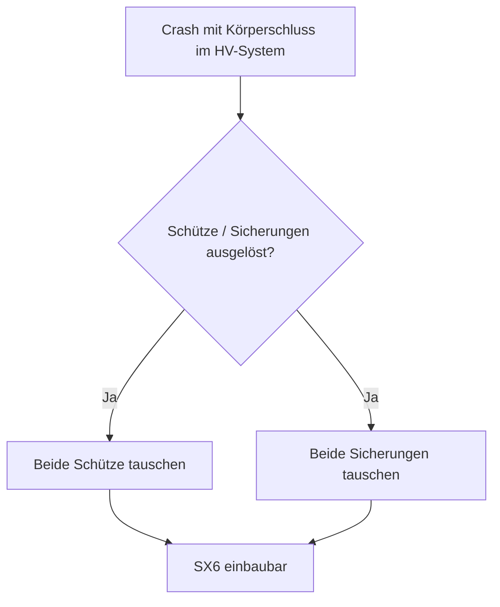
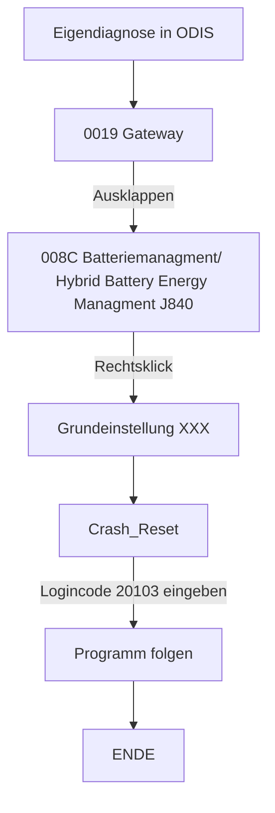

# Audi E-Tron GT HV Reset

In diesem Repository sind die Arbeitsschritte dokumentiert, die erforderlich waren, um den betroffenen Audi E-Tron GT nach einem Unfall wieder vollständig freizuschalten und in Betrieb zu nehmen. Der Bogen spannt sich von der initialen Fehlerdiagnose über die Arbeit mit ODIS und die Rückstellung der Airbag- und Hochvoltsysteme bis hin zur abschließenden Freigabe des Fahrzeugs.

## Haftungsausschluss

- Bei diesem Dokument handelt es sich um einen Erfahrungsbericht, der Fehler enthalten kann. Personen ohne entsprechende Sachkunde, Ausbildung oder Schulung wird dringend davon abgeraten, Arbeiten am Hochvoltsystem oder an Elektrofahrzeugen im Allgemeinen durchzuführen. Sämtliche Handlungen erfolgen auf eigene Gefahr. <!-- Hier besserer Rechtsschutz -->
- Sämtliche Abbildungen wurden mittels Künstlicher Intelligenz nachbearbeitet, um deren Lesbarkeit zu verbessern. Eine inhaltliche Veränderung fand dabei nicht statt.

## Audi E-Tron GT / Porsche Taycan

Beide Modelle basieren auf der J1-Plattform, die von Porsche entwickelt wurde. Für entsprechende Projekte ist zu beachten, dass eine Vielzahl von Bauteilen zwischen den Modellen austauschbar ist. (Wird ergänzt)

## Bestandsaufnahme

Bei dem betroffenen Fahrzeug handelt es sich um einen Audi E-Tron GT, Baujahr 2022. Das Fahrzeug erlitt einen rechtsseitigen Frontalcrash, dessen genauer Hergang bislang nicht abschließend geklärt werden konnte.

Im Zuge des Unfalls wurden sämtliche Frontairbags sowie die seitlichen Kopfairbags ausgelöst. Gemäß den technischen Vorgaben von Audi lässt sich dieser Schaden nicht durch einen Klemme-15-Reset (Abklemmen und erneutes Anklemmen der Batterie) beheben.

Folgende Komponenten waren in der Folge beschädigt:
- die gesamte rechte Fahrzeugfront
- der Laderegler
- die Hochvoltheizung
- der Scheinwerfer
- weitere, hier nicht im Detail aufgeführte Bauteile

## HV-Reset

Im Folgenden wird kurz der Aufbau des Schaltkastens der Hochvoltbatterie SX6 inklusive des Zünders für die Hochvoltbatterieunterbrechung N563 erläutert. Entgegen anderslautender Behauptungen in diversen Internetforen befinden sich darin **keine pyrotechnischen Sicherungen**.

> Im Unterschied dazu verfügen der Audi E-Tron 55, Q8 und Q4 über eine pyrotechnische Sicherung, die im Crashfall ausgelöst werden kann.

Im SX6 befinden sich stattdessen zwei Schütze (Relais größerer Bauart) sowie zwei Sicherungen, die in ihrer Bauform stark an NH-Sicherungen erinnern – jeweils eine für die positive sowie die negative Seite.

 <!-- Hier Bild aus Video vom Inneren der SX6 -->

Im Falle eines Unfalls mit Körperschluss des Hochvoltsystems besteht die Möglichkeit, dass diese Sicherungen auslösen. Sollte dies zutreffen, wird empfohlen, beide Schütze sowie beide Sicherungen zu ersetzen – unabhängig vom jeweils festgestellten Zustand, da ein Ausfall in absehbarer Zeit zu erwarten ist.

### 1. Erforderliche Werkzeuge und Ausrüstung

- Messgerät
- 1000-V-Schutzhandschuhe
- ODIS Service, Version 25.0.1 oder höher (bei älteren Versionen besteht die Möglichkeit, dass bestimmte Fehlercodes nicht korrekt interpretiert werden – es erscheint dann beispielsweise eine Meldung wie "P00001 Entwicklungscode 1")
  - **ohne Internetverbindung**
  - VX-Diag-Passthrough-Gerät J.... (XXX)
- Werkzeugkasten

**Weiterführende Hinweise**
- Herkunft der zugrunde liegenden Dokumentation (noch zu ergänzen)

### 2. Behebung der Fehler im Airbag-Steuergerät

Das Steuergerät 0015 Airbag darf keine statischen Fehler mehr aufweisen. Der Crash-Reset dieses Steuergeräts kann ausschließlich über eine ODIS-Online-Version vorgenommen werden, alternativ kann der entsprechende Service bei einschlägigen Anbietern im Internet erworben werden (~120 €).

Sämtliche übrigen Fehler, die im Zusammenhang mit den nicht mehr funktionsfähigen Airbags und Sicherheitsgurten stehen, können mit einer Offline-Version von ODIS zurückgesetzt werden.

Die Sicherheitsgurte müssen über die Grundeinstellung im Menü der geführten Funktionen neu angelernt werden. Im Anschluss werden die entsprechenden Fehler als passiv geführt und können gelöscht werden.

- 0015 Airbag → Geführte Funktionen → Grundeinstellung Sicherheitsgurt links, rechts usw.

Sämtliche weiteren Airbag-Fehler wechseln vom Status Aktiv/Statisch zu Passiv, sobald die betroffenen Airbags durch neue ersetzt sowie die zugehörigen Sensoren beziehungsweise Sensorleitungen instand gesetzt wurden. Anschließend können sämtliche Fehler gelöscht werden.

### 3. Klassifizierung des Hochvoltsystems

Nachdem das Hochvoltsystem durch einen entsprechend qualifizierten und berechtigten Techniker geprüft wurde, kann die Klassifizierung des Hochvoltsystems vorgenommen werden:

- Sonderfunktionen → Klassifizierung des Hochvoltsystems

Sofern der ODIS-Tester an dieser Stelle nicht in der Lage ist, die Zellspannungen der einzelnen Module auszulesen, deutet dies auf eine veraltete ODIS-Version hin, da die erforderlichen Daten in diesem Fall nicht in der Datenbank hinterlegt sind.

Nach Aktualisierung von ODIS auf die jeweils aktuelle Version (≥ 25.0.1) sollte sich die Klassifizierung erfolgreich abschließen lassen.

### 4. Initialisierung des Hochvoltsystems

<!-- War das wirklich der 3. Punkt? -->

Im Anschluss kann die Initialisierung des Hochvoltsystems vorgenommen werden – analog zum Vorgehen bei Wartungsarbeiten oder dem Austausch von Komponenten.

Tritt dabei der Fehler auf, dass das Steuergerät 008C Batteriemanagment/ Hybrid Battery Energy Managment J840 das Hochfahren des Systems blockiert, sind die nachfolgend dargestellten Spannungswerte zu sehen. 

Der Fehlerspeicher des Moduls J840 sollte nun erneut ausgelesen werden.

Im Steuergerät 008C sollten zu diesem Zeitpunkt folgende Fehler hinterlegt sein:

### 5. Grundeinstellung des Hochvoltsystems

<!-- Fehlercode thematisieren (HV-Kontaktor defekt o. Ä., inkl. Bild) -->

Es kann vorkommen, dass unter den in Punkt 4 genannten Fehlern im 008C die Meldung "Steuergerät defekt" oder eine vergleichbare Meldung angezeigt wird. Dies ist vermutlich darauf zurückzuführen, dass die Wartezeit für das Vorladen der Hochvoltkontakte aus Sicht des Steuergeräts zu lange angedauert und dieses daraufhin einen Defekt interpretiert hat.

> [!TIP]
> Über die Vorladekontakte werden die Kontakte mit reduziertem Strom über einen Widerstand vorgeladen, damit beim Einschalten weder ein zu hoher Einschaltlichtbogen noch ein zu hoher Einschaltstrom entsteht. Andernfalls könnten Bauteile durch den hohen Strom Schaden nehmen.

Andere Fehler wie "P0ADD00 Ansteuerung des Minuskontakt der Hybrid-/Hochvoltbatterie elektrischer Fehler (00101111 aktiv/statisch)" sind statischer Natur, da die Crash-Abschaltung des Hochvoltsystems innerhalb der Batterie (im SX6) weiterhin aktiv ist.

Diese Fehler lassen sich beheben, indem der Crash-Status mittels Eigendiagnose zurückgesetzt wird.

<!-- Bild vom Eigendiagnose-Button und -Tab -->

(XXX) (die Bezeichnung wird vermutlich nicht korrekt wiedergegeben und noch einmal überprüft)

Im Anschluss ist ein Zündwechsel durchzuführen. Beim Wiedereinschalten ist üblicherweise ein deutlich hörbares Schaltgeräusch der Schütze wahrzunehmen. Das Fahrzeug kann anschließend in die Fahrstufe D oder R geschaltet werden und ist fahrbereit.

 <!-- Bild ODIS-Connector-Fehler -->

<!-- Technische Erläuterungen zum Vorladewiderstand und den Schützen, Bezug zu oben -->

Login-Code: 20103
