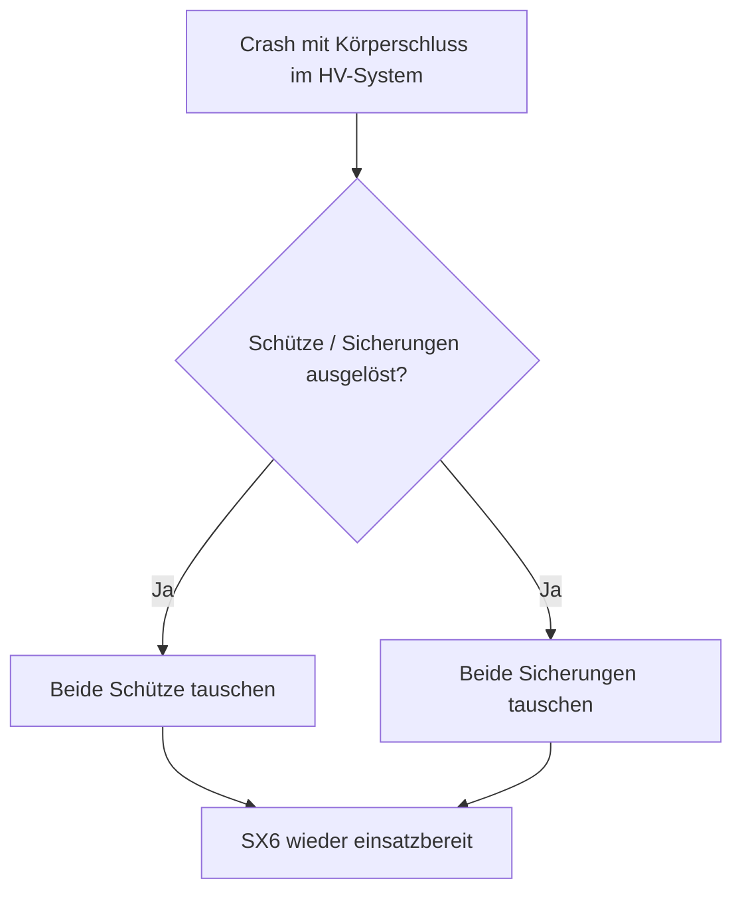
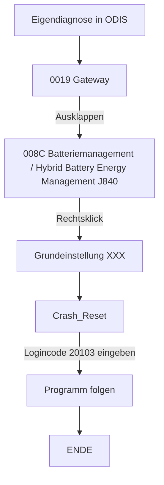

# Audi E-Tron GT HV Reset

In diesem Repository habe ich alle Schritte zusammengefasst, die nötig waren, um meinen Audi E-Tron GT nach einem Unfall wieder vollständig freizuschalten und in Betrieb zu nehmen. Von der ersten Fehlerdiagnose über die Arbeit mit ODIS, der Rückstellung der Airbag- und Hochvoltsysteme, bis hin zur finalen Freigabe durch das Fahrzeug.

## Disclaimer

- Dies ist nur ein Bericht meiner Erfahrung. Er kann Fehler enthalten. Jeder, der keine sachkundige Ausbildung oder Schulung besitzt, sollte keine Reparaturen am HV-System oder an E-Fahrzeugen im Allgemeinen durchführen. Handeln auf eigene Gefahr. <!-- Hier besserer Rechtsschutz -->
- Alle Bilder wurden mittels KI überarbeitet, damit sie besser lesbar sind. Es fand keine Änderung des groben Inhalts statt.

## Audi E-Tron GT / Porsche Taycan

Beide Modelle stehen auf der J1-Plattform, die von Porsche entwickelt wurde. Falls ihr Bauteile für euer Projekt benötigt: Viele Teile sind zwischen den Modellen austauschbar. (Hier kommt noch mehr)

## Bestandsaufnahme

Kurz zu meinem Fahrzeug: Es handelt sich um einen Audi E-Tron GT, Baujahr 2022. Das Fahrzeug hatte einen rechtsseitigen Frontalcrash (was genau passiert ist, weiß ich noch nicht).

Ausgelöst wurden alle Frontairbags sowie die seitlichen Kopfairbags. Laut den technischen Daten von Audi ist dieser Crash nicht durch einen Klemme-15-Reset (Batterie abklemmen und wieder anklemmen) behebbar.

Beschädigt war somit:
- die gesamte rechte Fahrzeugfront
- der Laderegler
- die Hochvoltheizung
- der Scheinwerfer
- usw.

## HV-Reset

Kurz zum Aufbau des Schaltkastens der Hochvoltbatterie SX6 inklusive Zünder für Hochvoltbatterieunterbrechung N563: Darin befinden sich **keine pyrotechnischen Sicherungen**. In manchen Foren im Internet wird das Gegenteil behauptet, dies ist jedoch nicht richtig.

> [!TIP]
> Anders als beim Audi E-Tron 55, Q8 und Q4: Diese besitzen eine pyrotechnische Sicherung, die bei einem Crash ausgelöst werden kann.

Im SX6 befinden sich stattdessen 2 Schütze (große Relais) und 2 Sicherungen (die stark an NH-Sicherungen erinnern) – eine für die positive und eine für die negative Seite.

 <!-- Hier Bild aus Video vom Inneren der SX6 -->

Es kann sein, dass bei einem Crash mit einem Körperschluss des HV-Systems diese Sicherungen auslösen. Sollte dies der Fall sein, sollten beide Schütze und beide Sicherungen getauscht werden – unabhängig davon, ob sie aktuell defekt sind oder nicht (wenn sie es jetzt noch nicht sind, werden sie es bald sein).

### 1. Benötigte Werkzeuge

- Messgerät
- 1000V-Handschuhe
- ODIS Service V.25.0.1 oder neuer (bei älteren Versionen kann es sein, dass manche Fehlercodes nicht richtig interpretiert werden – dann erscheint z. B. "P00001 Entwicklungscode 1" o. Ä.)
  - **keine Internetverbindung**
  - VX-Diag Passthrough-Gerät J.... (XXX)
- Werkzeugkasten

**Interessantes**
- Woher Dokumentation?

### 2. Fehler im Airbag-Steuergerät beheben

Das Steuergerät 0015 Airbag darf keine statischen Fehler mehr enthalten. Der Crash-Reset in diesem Steuergerät kann nur mit einer ODIS-Online-Version erfolgen, oder der Service wird bei einschlägigen Anbietern im Internet erworben (~120 €).

Alle anderen Fehler, die mit den nicht mehr funktionsfähigen Airbags und Sicherheitsgurten zusammenhängen, können mit einer Offline-Version von ODIS zurückgesetzt werden.

Die Sicherheitsgurte müssen über die Grundeinstellung im Menü "Geführte Funktionen" neu angelernt werden. Danach sind diese Fehler passiv und können gelöscht werden.

- 0015 Airbag → Geführte Funktionen → Grundeinstellung Sicherheitsgurt Li, Re usw.

Alle anderen Airbag-Fehler wechseln von Aktiv/Statisch zu Passiv, sobald die Airbags durch neue ersetzt sowie die Sensoren bzw. Sensorleitungen repariert wurden. Danach können alle Fehler gelöscht werden.

### 3. Klassifizierung des HV-Systems

Nachdem das Hochvoltsystem von einem Techniker mit der nötigen Freigabe geprüft wurde, kann das HV-System klassifiziert werden:

- Sonderfunktionen → Klassifizierung des Hochvoltsystems

Sollte der ODIS-Tester hier die Zellspannungen der einzelnen Module nicht lesen können, ist die ODIS-Version zu alt – die benötigten Daten fehlen dann in der Datenbank.

Nachdem ODIS auf die neueste Version aktualisiert wurde (Version ≥ 25.0.1), sollte die Klassifizierung erfolgreich abgeschlossen werden.

### 4. Initialisierung des HV-Systems

<!-- War das wirklich der 3. Punkt? -->

Danach kann versucht werden, das HV-System zu initialisieren – so, wie es auch gemacht wird, wenn das Fahrzeug gewartet oder Komponenten ausgetauscht wurden.

Erscheint dabei der Fehler, dass das Steuergerät 008C Batteriemanagement/Hybrid Battery Energy Management J840 das Hochfahren blockiert, müssen die folgenden Spannungswerte ausgelesen und der Fehlerspeicher des Moduls J840 erneut ausgelesen werden.

Im 008C sollten nun folgende Fehler hinterlegt sein:

### 5. Grundeinstellung des HV-Systems

<!-- Fehlercode thematisieren (HV-Kontaktor defekt o. Ä., inkl. Bild) -->

Es kann vorkommen, dass unter den Fehlern aus Punkt 4 im 008C "Steuergerät defekt" oder Ähnliches steht. Das scheint daran zu liegen, dass die Wartezeit für das Vorladen der Hochvoltkontakte laut Steuergerät zu lange gedauert hat, wodurch ein Defekt interpretiert wird.

> [!TIP]
> Die Vorladekontakte laden die Kontakte mit einem geringeren Strom über einen Widerstand vor, damit der Einschaltlichtbogen bzw. der Einschaltstrom nicht zu hoch ist. Dieser könnte durch einen zu hohen Strom sonst Bauteile beschädigen.

Andere Fehler wie "P0ADD00 Ansteuerung des Minuskontakt der Hybrid-/Hochvoltbatterie elektrischer Fehler (00101111 aktiv/statisch)" sind statisch, da die Crash-Abschaltung des HV-Systems in der Batterie (im SX6) noch aktiv ist.

Dies kann behoben werden, indem mittels Eigendiagnose der Crash zurückgesetzt wird.

<!-- Bild vom Eigendiagnose-Button und -Tab -->

(XXX) (der Name ist vermutlich falsch, wird nochmal geprüft)

Danach einen Zündwechsel durchführen – beim Wiedereinschalten sollte ein lautes Schützschalten zu hören sein. Das Fahrzeug kann anschließend in D oder R geschaltet werden und fährt.

 <!-- Bild ODIS-Connector-Fehler -->

<!-- Technische Erläuterungen zum Vorladewiderstand und den Schützen, Bezug zu oben -->

Zu guter Letzt muss via Eigendiagnose der Crash-Wert im HV-System zurückgesetzt werden. Dazu: Eigendiagnose → HV-Hybridmanagement 008C Batteriemanagement/Hybrid Battery Energy Management J840.

Login-Code: 20103
